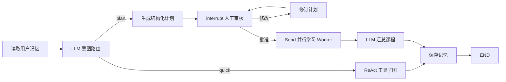

# LangGraph 中文完整学习项目

这是一个可运行、可修改、可测试的 LangGraph 教学项目。它不是只有一个聊天节点的
“Hello World”，而是从最小状态图逐步走到包含真实模型、工具调用、人工审核、并行
执行、检查点和长期记忆的综合学习助手。

项目依赖版本来自 `E:\potato_python\normal_agent` 当前实际 Poetry 环境，并固定在
LangGraph `0.3.34`。代码中的模块说明、函数文档和关键逻辑均使用详细中文注释。

## 学习路线图

示例按学习难度分为五大类，**序号即推荐学习顺序**：

| 序号 | 分类 | 示例文件 | 核心能力 | 需要模型 |
| --- | --- | --- | --- | --- |
| 01 | 基础入门 | `ex01_状态图基础` | StateGraph、节点、普通边、START/END、输入输出 schema、reducer | 否 |
| 02 | 基础入门 | `ex02_条件路由与循环` | Command、条件边、循环、recursion limit | 否 |
| 03 | 基础入门 | `ex03_并行与MapReduce` | Send、动态并行、Map-Reduce | 否 |
| 04 | 状态管理 | `ex04_检查点与时间旅行` | MemorySaver、thread_id、历史、状态编辑、时间旅行 | 否 |
| 05 | 状态管理 | `ex05_长期记忆` | InMemoryStore、user_id、跨线程长期记忆 | 否 |
| 06 | 人机交互 | `ex06_人工审核` | interrupt、暂停、Command(resume) | 否，需终端交互 |
| 07 | 人机交互 | `ex07_流式输出` | updates、values、custom、debug 流 | 否 |
| 08 | 高级模式 | `ex08_子图协作` | 父图、子图、多角色协作 | 否 |
| 09 | 高级模式 | `ex09_容错与重试` | RetryPolicy、瞬时错误重试、降级分支 | 否 |
| 10 | 模型集成 | `ex10_ReAct智能体` | 真实模型、bind_tools、ToolNode、手写 ReAct 循环 | 是 |
| 11 | 模型集成 | `ex11_综合学习助手` | 路由、ReAct、计划审核、Send 并行、记忆、流式输出 | 是 |

> 学习顺序：**基础入门**（01-03）→ **状态管理**（04-05）→ **人机交互**（06-07）→ **高级模式**（08-09）→ **模型集成**（10-11）

## 1. 环境与安装

要求 Python `3.11`、`3.12` 或 `3.13`，推荐使用项目已经验证过的 Poetry 2.x。

```powershell
cd E:\project\agent\langGraph
poetry install
```

确认命令入口：

```powershell
poetry run python -m langgraph_demo list
```

也可以使用 Poetry 安装的脚本：

```powershell
poetry run langgraph-demo list
```

`list` 命令会按分类分组展示所有示例：

```text
【基础入门】
  01  basic           State、节点、普通边、输入输出 schema
  02  routing         Command、条件边和有限循环
  03  parallel        Send 并行 Map-Reduce 与 reducer

【状态管理】
  04  persistence     检查点、线程、历史、状态编辑和时间旅行
  05  memory          Store 与跨线程用户长期记忆

【人机交互】
  06  human-review    interrupt 与 Command(resume) 人工审核 [交互]
  07  streaming       updates 与 custom 流式输出

【高级模式】
  08  subgraph        父图、子图和多角色协作
  09  resilience      RetryPolicy 和显式降级路径

【模型集成】
  10  react           真实模型、ToolNode 和手写 ReAct 循环 [真实模型]
```

## 2. 配置真实模型

基础示例完全不需要 API Key。`react` 和 `assistant` 按计划只调用真实的 OpenAI
兼容模型，不提供规则模型作为运行时兜底。

复制配置模板：

```powershell
Copy-Item .env.example .env
```

然后填写：

```dotenv
OPENAI_API_KEY=你的真实密钥
OPENAI_BASE_URL=https://api.openai.com/v1
OPENAI_MODEL=gpt-4o-mini
OPENAI_TEMPERATURE=0
```

- 使用 OpenAI 官方接口时，`OPENAI_BASE_URL` 可以省略。
- 使用 DeepSeek 或内部兼容网关时，填写对应 URL 和模型名。
- 为兼容参考工程，也接受旧变量名 `OPENAI_API_BASE`。
- ReAct 示例要求模型支持标准工具调用。

执行环境诊断（不会调用模型、不会产生费用）：

```powershell
poetry run python -m langgraph_demo doctor
```

## 3. 运行独立示例

```powershell
# 01 最小状态图
poetry run python -m langgraph_demo run basic --input "LangGraph 状态管理"

# 02 Command、条件边和循环
poetry run python -m langgraph_demo run routing --input 5

# 03 用英文逗号分隔并行主题
poetry run python -m langgraph_demo run parallel --input "State,Reducer,Send"

# 04 检查点与时间旅行
poetry run python -m langgraph_demo run persistence

# 05 跨线程长期记忆
poetry run python -m langgraph_demo run memory

# 06 人工审核，运行后在终端输入 approve
poetry run python -m langgraph_demo run human-review

# 07 updates 与 custom 双流
poetry run python -m langgraph_demo run streaming

# 08 父图调用多角色子图
poetry run python -m langgraph_demo run subgraph

# 09 第一次失败、自动重试成功，并演示显式降级
poetry run python -m langgraph_demo run resilience

# 10 真实模型发起计算器 tool call
poetry run python -m langgraph_demo run react
```

## 4. 运行综合学习助手

快速问答会进入 ReAct 子图；学习计划类请求会暂停等待审核。

```powershell
poetry run python -m langgraph_demo assistant `
  --thread-id learning-thread-1 `
  --user-id student-1 `
  --input "帮我制定一个三天的 LangGraph 学习计划"
```

看到计划后：

- 输入 `approve`：使用 `Send` 并行生成各步骤材料；
- 输入任意修改意见：模型修订计划，然后再次进入审核点。

`thread-id` 区分短期检查点，`user-id` 区分长期用户档案。两者不是同一个概念。



## 5. 推荐学习顺序

1. 运行 `basic`（示例 01），在节点中新增一个状态字段。
2. 运行 `routing`（示例 02），改变奇偶路由和循环退出条件。
3. 运行 `parallel`（示例 03），观察 reducer 如何合并并行结果。
4. 对比 `persistence`（示例 04）的 thread 与 `memory`（示例 05）的 user namespace。
5. 在 `human-review`（示例 06）中分别批准和拒绝。
6. 用不同 `stream_mode` 运行 `streaming`（示例 07）。
7. 阅读 `subgraph`（示例 08），尝试给子图新增一个角色。
8. 阅读 `react`（示例 10）的 `model -> tools -> model` 循环。
9. 配置真实模型后运行综合 `assistant`（示例 11）。

详细教程位于：

- [核心概念与状态](docs/01_核心概念与状态.md)
- [路由、并行与容错](docs/02_路由并行与容错.md)
- [持久化、记忆与时间旅行](docs/03_持久化记忆与时间旅行.md)
- [人工介入与流式输出](docs/04_人工介入与流式输出.md)
- [工具与 ReAct](docs/05_工具与ReAct.md)
- [综合助手解析](docs/06_综合助手解析.md)
- [Studio、版本与迁移](docs/07_Studio与版本.md)
- [常见问题](docs/08_常见问题.md)

## 6. 项目结构

```text
langGraph/
├── docs/                              # 分主题中文教程（已按序号命名）
│   ├── 01_核心概念与状态.md
│   ├── 02_路由并行与容错.md
│   ├── 03_持久化记忆与时间旅行.md
│   ├── 04_人工介入与流式输出.md
│   ├── 05_工具与ReAct.md
│   ├── 06_综合助手解析.md
│   ├── 07_Studio与版本.md
│   └── 08_常见问题.md
├── src/langgraph_demo/
│   ├── __init__.py                    # 包入口
│   ├── __main__.py                    # python -m 启动入口
│   ├── config.py                      # 环境变量校验与模型配置
│   ├── llm.py                         # 真实 ChatOpenAI 工厂
│   ├── tools.py                       # 安全本地工具（计算器、时间、术语、统计）
│   ├── cli.py                         # 统一命令行入口（list / run / assistant / doctor）
│   └── graphs/                        # 示例代码（每个概念一个可导入图）
│       ├── __init__.py                # 示例索引（含分类表）
│       ├── ex01_状态图基础.py          # 【基础入门】StateGraph、节点、边、reducer
│       ├── ex02_条件路由与循环.py      # 【基础入门】Command、条件边、循环
│       ├── ex03_并行与MapReduce.py     # 【基础入门】Send、动态并行、Map-Reduce
│       ├── ex04_检查点与时间旅行.py    # 【状态管理】MemorySaver、thread_id、历史
│       ├── ex05_长期记忆.py            # 【状态管理】InMemoryStore、user_id、跨线程
│       ├── ex06_人工审核.py            # 【人机交互】interrupt、暂停、Command(resume)
│       ├── ex07_流式输出.py            # 【人机交互】updates、values、custom 流
│       ├── ex08_子图协作.py            # 【高级模式】父图、子图、多角色协作
│       ├── ex09_容错与重试.py          # 【高级模式】RetryPolicy、重试、降级
│       ├── ex10_ReAct智能体.py         # 【模型集成】真实模型、ToolNode、ReAct 循环
│       └── ex11_综合学习助手.py        # 【模型集成】路由+ReAct+审核+并行+记忆综合
├── tests/                             # unittest，无网络默认测试
│   ├── test_core_graphs.py            # 基础图测试（01-03、08-09）
│   ├── test_stateful_features.py      # 状态特性测试（04-07）
│   ├── test_react_and_assistant.py    # ReAct 与综合助手测试（10-11）
│   ├── test_real_llm.py              # 真实模型冒烟测试（需手动开启）
│   └── test_project_contract.py       # 项目契约测试（CLI、langgraph.json、版本）
├── .env.example                       # 环境变量模板
├── .gitignore
├── langgraph.json                     # Studio 图注册（已注册全部 11 个示例）
├── pyproject.toml                     # Poetry 项目配置
├── poetry.lock
├── requirements-studio.txt            # Studio 可选依赖
└── studio_main.py                     # 企业内部 API 运行时可选入口
```

## 7. 测试

默认测试注入模拟模型，不访问网络、不产生模型费用：

```powershell
poetry run python -m unittest discover -s tests -v
```

配置 `.env` 后，可以显式运行真实模型冒烟测试：

```powershell
$env:RUN_REAL_LLM_TESTS="1"
poetry run python -m unittest tests.test_real_llm -v
```

## 8. Studio 与版本说明

`langgraph.json` 已注册全部 11 个示例图。参考工程的 Studio/API 运行时是企业内部
`langgraph-api 1.7.x`，安装方式记录在 `requirements-studio.txt`，但项目不会复制
私有包源地址或认证信息。详见
[Studio、版本与迁移](docs/07_Studio与版本.md)。

本项目有意固定 LangGraph `0.3.34`，以便与参考工程代码保持一致。当前
[LangGraph 官方文档](https://docs.langchain.com/oss/python/langgraph/overview)
以较新的 1.x API 为主；学习时应先确认正在查看的文档版本。

## 安全约束

- `.env` 已加入 `.gitignore`。
- 示例中没有任何真实密钥、私有仓库密码或内部服务地址。
- 计算器使用 AST 白名单，不执行任意 Python 代码。
- `MemorySaver` 和 `InMemoryStore` 都只在当前进程存活；它们适合教学，不等于
  生产级持久化数据库。

## 9. 数据中台治理图学习实验室

本仓库还包含一个独立的全栈学习项目：`src/data_platform`。它用 FastAPI、原生
静态页面、LangGraph `MemorySaver` 和本地 Mock 任务引擎实现计划审核、异步等待、
幂等任务、失败阻断和发布结果确认，不需要真实模型或任何外部服务。

```powershell
pip install -e .
python -m data_platform
```

打开 <http://127.0.0.1:8000>，按页面按钮批准计划并模拟每一步的成功/失败回调。
完整的设计说明、学习顺序和接口行为见
[数据中台治理学习项目](docs/09_数据中台治理学习项目.md)。
