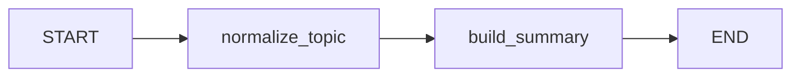

# 01：核心概念、状态与 Reducer

## 1. LangGraph 解决什么问题

普通函数调用通常把控制流写死在代码中；Agent 又需要根据状态动态选择工具、暂停、
恢复、循环或并行。LangGraph 把这类程序表示为一个有状态图：

- **State**：节点之间共享的数据；
- **Node**：读取当前状态并返回局部更新；
- **Edge**：决定执行顺序；
- **Runtime**：执行图、合并更新、保存检查点和输出事件。



对应代码位于 `src/langgraph_demo/graphs/ex01_状态图基础.py`。

## 2. 节点返回的是更新，不是完整 State

```python
def normalize_topic(state: BasicState) -> dict[str, object]:
    return {
        "normalized_topic": state["topic"].strip(),
        "notes": ["已清理主题"],
    }
```

节点没有返回 `summary` 并不意味着删除它。LangGraph 会把返回字典看作本步骤的更新，
再依据每个字段的 reducer 合并到状态。

这种写法的好处是：

1. 节点只负责自己拥有的字段；
2. 状态更新更容易追踪；
3. 多个并行节点可以分别返回局部更新。

## 3. Reducer 为什么重要

默认 reducer 是覆盖：新值替换旧值。列表日志通常希望追加：

```python
class BasicState(TypedDict, total=False):
    notes: Annotated[list[str], operator.add]
```

如果两个节点依次返回：

```python
{"notes": ["第一步"]}
{"notes": ["第二步"]}
```

最终结果是 `['第一步', '第二步']`。没有 `operator.add` 时，最终只剩
`['第二步']`。

并行图尤其需要 reducer。多个 Worker 同时写 `reports` 时，LangGraph 必须知道是
合并列表还是报告冲突。

## 4. 输入、内部状态和输出可以不同

基础图使用：

```python
StateGraph(BasicState, input=BasicInput, output=BasicOutput)
```

- `BasicInput` 限制调用方只需提供 `topic`；
- `BasicState` 包含节点之间使用的中间字段；
- `BasicOutput` 避免把内部实现细节全部暴露出去。

大型系统中，这种边界能避免调用方依赖临时字段。

## 5. START、END 和 compile

`START`、`END` 是框架提供的虚拟节点：

```python
builder.add_edge(START, "normalize_topic")
builder.add_edge("build_summary", END)
graph = builder.compile()
```

构建阶段描述拓扑，`compile()` 阶段校验连接并生成实现 Runnable 接口的可执行图。
编译后可以调用：

- `invoke` / `ainvoke`：一次性获取结果；
- `stream` / `astream`：逐事件消费；
- `get_state`：读取检查点状态；
- `update_state`：基于检查点创建状态修改。

后两项要求图配置 checkpointer。

## 6. 建议练习

1. 给 `BasicState` 增加 `topic_length`。
2. 新增一个节点计算长度，并把它加入 `BasicOutput`。
3. 删除 `notes` 的 reducer，对比运行结果。
4. 把 `build_summary` 放在 `normalize_topic` 前，观察缺少字段时的错误。

