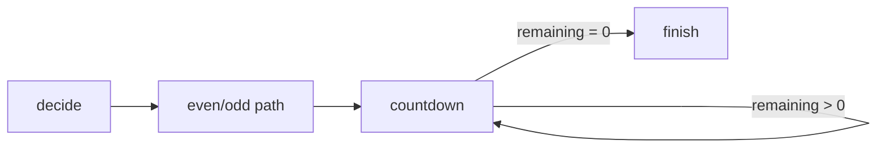
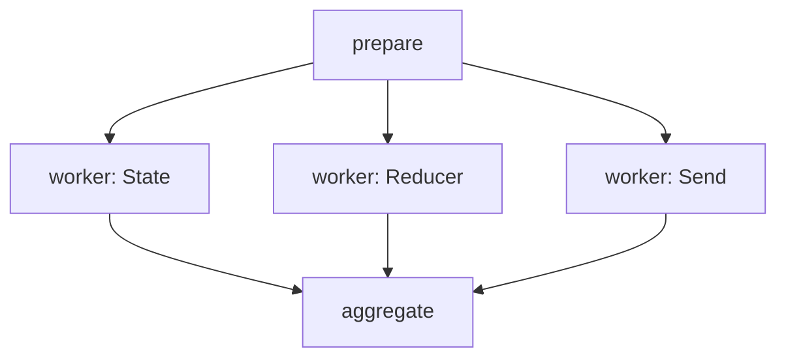
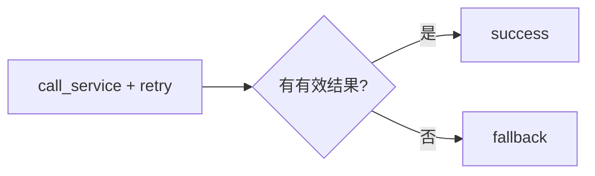

# 02：路由、循环、并行与重试

## 1. 条件边与 Command 的区别

条件边函数只负责选择下一节点：

```python
def continue_or_finish(state):
    return "countdown" if state["remaining"] > 0 else "finish"
```

`Command` 可以在一个节点返回值中同时表达状态更新和跳转：

```python
return Command(
    update={"parity": "偶数"},
    goto="even_path",
)
```

经验规则：

- 路由逻辑独立且不修改状态时，优先条件边；
- 节点的业务结果天然决定跳转时，可以使用 `Command`；
- 返回类型写成 `Command[Literal[...]]`，有利于类型检查和图渲染。

## 2. 循环必须有退出条件



每个图调用都受 `recursion_limit` 保护。它是最后防线，不应替代业务退出条件：

```python
graph.invoke(input_state, {"recursion_limit": 20})
```

如果条件永远返回循环节点，达到限制后会抛出递归错误。

## 3. Send 如何实现动态并行

固定并行可以从一个节点连出多条边。任务数量来自运行时数据时，使用 `Send`：

```python
return [
    Send("study_worker", {"subject": subject})
    for subject in state["cleaned_subjects"]
]
```



每个 Worker 返回 `{"reports": [result]}`。父状态把 `reports` 声明成加法 reducer，
所有结果才会被保留。

并行执行的完成顺序通常不稳定。不要把列表到达顺序当作业务顺序；示例在汇总节点
中排序。如果必须保留计划顺序，应给每条结果携带显式 `index` 再排序。

## 4. RetryPolicy 适合什么错误

`resilience.py` 给服务节点添加：

```python
RetryPolicy(
    initial_interval=0.01,
    backoff_factor=1.0,
    max_attempts=3,
    retry_on=TemporaryServiceError,
)
```

适合重试：

- 网络瞬断；
- 临时限流；
- 服务端短暂不可用。

不适合重试：

- API Key 缺失；
- 输入校验失败；
- 代码逻辑错误；
- 明确的权限拒绝。

综合助手用一个谓词排除 `ModelConfigurationError`，避免缺少配置时无意义等待。

## 5. 重试与降级不是一回事

重试是在同一节点重新执行；降级是业务图选择另一条路径：



生产系统经常组合二者：先对瞬时错误重试，仍无法提供有效结果时再进入降级节点。

## 6. 建议练习

1. 把 `routing` 的奇偶分支改为正数、负数、零三条分支。
2. 在并行结果中加入 `index`，恢复输入顺序。
3. 把 `failures_before_success` 改为 3，观察重试耗尽异常。
4. 修改 `retry_on`，让 `ValueError` 不被重试。

