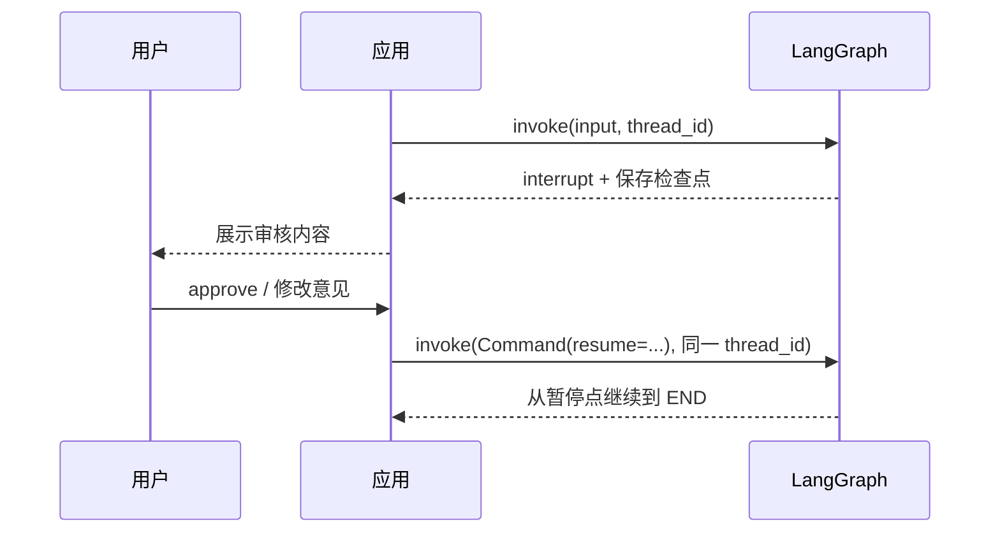

# 04：人工介入与流式输出

## 1. interrupt 的执行语义

节点中的：

```python
answer = interrupt({"question": "是否批准？", "proposal": proposal})
```

第一次执行到这里时不会得到 `answer`，而是暂停整张图并保存检查点。应用读取状态，
把问题展示给用户。之后使用相同 thread_id 恢复：

```python
graph.invoke(Command(resume="approve"), config)
```

节点会从头重新执行，直到同一个 `interrupt()`；这一次表达式返回 `approve`。

因此 interrupt 之前的副作用必须设计成幂等的。不要在 interrupt 前无保护地重复扣款、
发送邮件或创建不可重复任务。



## 2. 静态中断与动态中断

- `interrupt_before=["node"]`：编译或调用图时配置，在进入指定节点前暂停；
- `interrupt_after=["node"]`：节点执行完后暂停；
- `interrupt(payload)`：节点代码根据业务条件动态暂停。

本项目使用动态中断，因为审核内容需要携带具体计划。

## 3. 常用 stream_mode

| 模式 | 输出内容 | 适用场景 |
| --- | --- | --- |
| `values` | 每一步后的完整状态 | 入门观察、简单 UI |
| `updates` | 当前步骤产生的局部状态更新 | 日志、状态面板 |
| `messages` | LLM 消息 token 与元数据 | 打字机式聊天输出 |
| `custom` | 节点主动发出的任意事件 | 进度条、业务事件 |
| `debug` | 更完整的运行时调试事件 | 深度排查 |

一次调用可以订阅多个模式：

```python
for mode, chunk in graph.stream(
    input_state,
    stream_mode=["updates", "custom"],
):
    print(mode, chunk)
```

## 4. custom 事件

节点内：

```python
writer = get_stream_writer()
writer({"stage": "process", "progress": 75})
```

调用方只有订阅 `custom` 才能看到这条数据。它不自动写入 State，也不会影响下游节点。
如果数据之后还要参与计算，应同时返回状态更新。

## 5. messages 流

只要模型调用发生在 LangGraph 节点内部，运行时可以捕获消息 token。综合助手同时订阅
`messages` 和 `updates`：用户看到文本逐步产生，也能看到完成了哪些节点。

部分兼容网关不支持真正的 token 流，可能一次返回完整消息。这是网关能力差异，不是
状态图失效。

## 6. 子图流

`stream(..., subgraphs=True)` 会包含子图命名空间。应用处理事件时不能假定每个 chunk
永远只有两层结构；CLI 示例采取保守解析，并主要展示消息文本和节点名称。

## 7. 建议练习

1. 给 streaming 图增加 50% 的 custom 事件。
2. 分别用 `values` 和 `updates` 运行，对比数据大小。
3. 在人工审核拒绝路径中增加第二个 interrupt。
4. 在 interrupt 前后打印计数，确认恢复时节点会重新执行。

