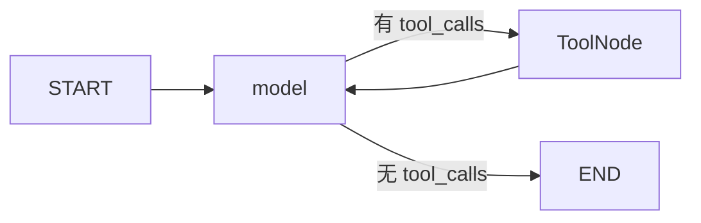

# 05：工具调用与手写 ReAct

## 1. ReAct 循环

ReAct 可以理解为“推理并行动”的循环。模型不直接执行函数，而是生成结构化
`tool_calls`；`ToolNode` 找到对应工具、执行并产生 `ToolMessage`；模型读取结果后决定
继续调用工具还是给出最终答案。



这张图位于 `src/langgraph_demo/graphs/ex10_ReAct智能体.py`，没有使用高级 `create_react_agent`
封装，便于直接观察循环细节。

## 2. bind_tools 做了什么

```python
bound_model = model.bind_tools(TOOLS)
```

LangChain 根据工具名称、docstring 和类型注解生成 JSON Schema，并把它们作为模型可用
工具发送给兼容接口。模型返回的 `AIMessage.tool_calls` 大致包含：

```python
{
    "name": "safe_calculator",
    "args": {"expression": "(12 + 8) * 3"},
    "id": "call_123",
    "type": "tool_call",
}
```

不是所有聊天模型都支持工具调用。只会返回文本的模型无法完成本示例。

## 3. ToolNode 的职责

`ToolNode` 会：

1. 读取最后一条 AIMessage 的 tool_calls；
2. 按名称查找工具；
3. 校验参数；
4. 执行函数；
5. 生成带相同 tool_call_id 的 ToolMessage。

模型下一次调用时必须看到原 AIMessage 和 ToolMessage，因此 State 使用
`MessagesState`。它自带 `add_messages` reducer，能按消息 ID 追加或替换消息。

## 4. 项目内置工具

| 工具 | 用途 |
| --- | --- |
| `safe_calculator` | 算术表达式计算 |
| `current_time` | IANA 时区当前时间 |
| `langgraph_glossary` | 本地 LangGraph 术语表 |
| `text_statistics` | 字符、非空白字符和单词统计 |

计算器只允许：数字、括号、加减乘除、整除、取模和有限乘方。它遍历 Python AST
白名单，不执行任意 Python 源码。模型生成工具参数也属于不可信输入，必须校验。

## 5. 路由函数

```python
def route_after_model(state):
    last_message = state["messages"][-1]
    return "tools" if last_message.tool_calls else END
```

最终答案同样是 AIMessage，区别是 `tool_calls` 为空。不要通过搜索回答文本中的
“工具”字样来判断路由。

## 6. 递归限制

如果模型不断调用工具，图会形成无限循环。调用时设置：

```python
graph.invoke(input_state, {"recursion_limit": 20})
```

系统提示词也应要求模型在得到足够信息后回答。生产系统还可以记录工具次数并设置业务
级上限，给用户返回可理解的降级信息。

## 7. 真实模型与测试模型

运行项目时，ReAct 只使用 `ChatOpenAI` 连接真实兼容接口。单元测试注入脚本模型：

1. 第一次返回一个计算器 tool call；
2. ToolNode 真实执行安全计算器；
3. 第二次返回最终 AIMessage。

这样可以稳定验证图逻辑而不产生费用。测试模型不是 CLI 的运行时兜底。

## 8. 建议练习

1. 新增一个只读的本地课程查询工具。
2. 让模型连续调用术语工具和计算器。
3. 故意传入不合法表达式，查看 ToolNode 错误消息。
4. 给工具增加参数范围校验。

