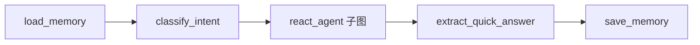
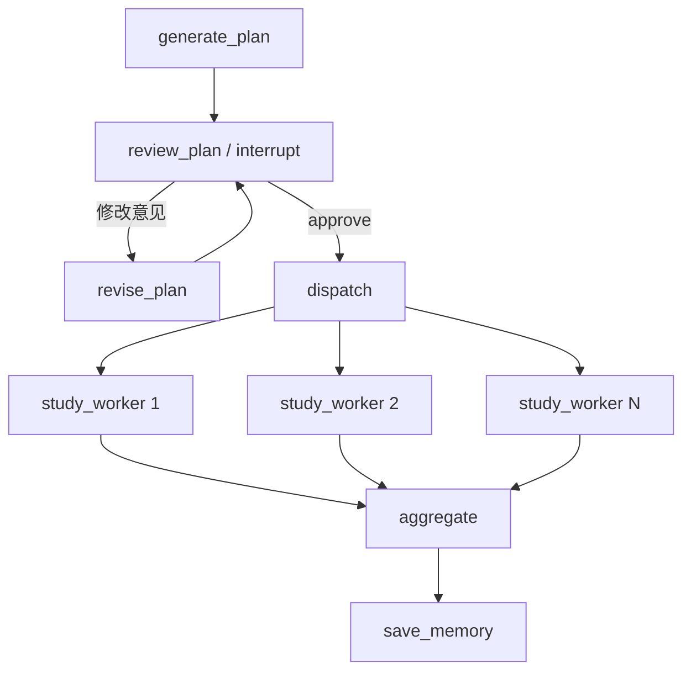

# 06：综合学习助手设计解析

## 1. 为什么需要综合图

独立示例帮助理解 API，但真实 Agent 往往同时需要：

- 根据意图走不同工作流；
- 使用工具；
- 让用户审批高成本计划；
- 并行处理多个子任务；
- 保存会话与用户记忆；
- 流式反馈进度；
- 对模型错误重试。

`assistant.py` 把这些能力组合成一个仍然可以阅读和测试的学习助手。

## 2. 状态设计

`AssistantState` 扩展 `MessagesState`，主要字段分为四类：

| 类别 | 字段 | 含义 |
| --- | --- | --- |
| 输入 | `request`、`messages` | 当前用户请求及消息历史 |
| 路由 | `route`、`route_reason` | quick 或 plan |
| 计划 | `plan`、`review_feedback` | 结构化计划和修改意见 |
| 执行 | `topic_results`、`final_answer` | 并行结果和最终答案 |
| 记忆 | `memory` | Store 中读取的用户档案 |

`topic_results` 使用 reducer。为了避免同一 thread 的旧并行结果污染下一轮，结果还携带
当前 `request`，汇总节点只选择本轮数据。生产系统可以改用唯一 `run_id`。

## 3. 快速问答路径



路由输出由 Pydantic `IntentDecision` 约束，不通过脆弱的自然语言关键词解析。
ReAct 子图和独立 `react` 示例使用相同的工具集合。

## 4. 规划路径



`LearningPlan` 限制步骤数为 1 到 5，防止一次动态创建过多模型任务。提示词要求 2 到
5 步，但 schema 保留 1 步作为兼容边界。

人工修改不是直接改字典，而是进入 `revise_plan` 重新产生符合 schema 的计划，然后
再次审核。这样用户始终看得到即将执行的最终结构。

## 5. 并行 Worker

审核通过后，`dispatch_steps` 为每个步骤返回 `Send`。每个 Worker 使用相同模型，但只
接收总目标、当前步骤和必要记忆，不接收整张巨大 State。

并行模型请求会提高吞吐，也可能更快触发网关限流。`RetryPolicy` 能处理部分瞬时错误，
生产环境仍应根据供应商限制配置并发、速率和超时。

## 6. 检查点与 Store

综合图同时编译：

```python
builder.compile(
    checkpointer=MemorySaver(),
    store=InMemoryStore(),
)
```

- checkpointer 让 plan 审核可以暂停和恢复；
- Store 记录用户运行次数、最近请求、最近路由和计划标题；
- CLI 的 thread_id 和 user_id 分别传入 `configurable`。

## 7. 模型延迟创建

模块导入时不会调用 `load_model_settings()`。节点第一次运行模型时才创建 ChatOpenAI：

- `langgraph.json` 可以在没有立即请求模型的情况下导入图；
- `list` 和基础示例不需要 API Key；
- 缺少配置时，真正需要模型的节点抛出明确中文错误。

## 8. 流式输出

CLI 同时订阅：

- `messages`：尽可能显示真实模型 token；
- `updates`：显示完成的节点；
- `subgraphs=True`：包含 ReAct 子图事件。

到达人工审核点后，CLI 从 `get_state(config).next` 判断图仍有待执行节点，获取终端输入
并用 `Command(resume=...)` 继续。

## 9. 建议扩展

1. 给用户档案增加偏好语言和每日可学习时间。
2. 为计划步骤添加优先级、预计分钟数和依赖关系。
3. 给 Worker 增加只读检索工具。
4. 将 InMemory 实现替换为数据库后端。
5. 在 aggregate 前增加事实核查节点。

